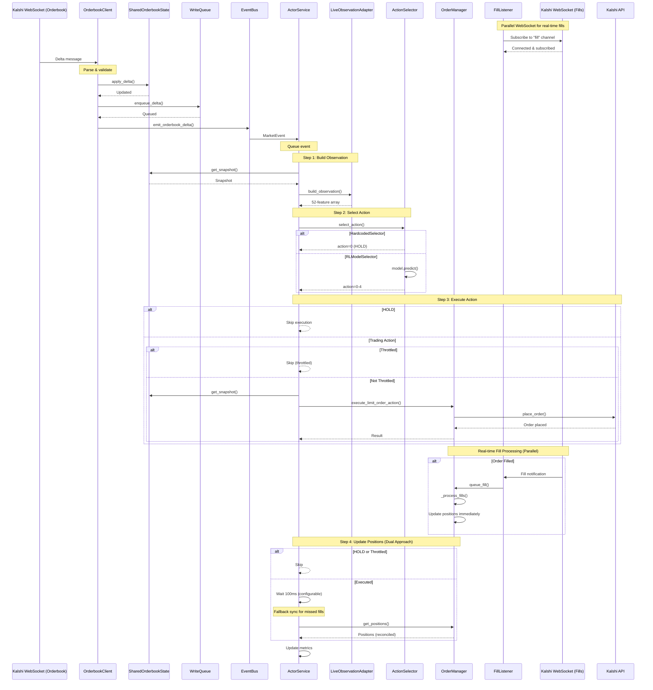

# Orderbook Delta Message Flow

## Sequence Diagram



## Simple Text Flow

```
1. Kalshi WebSocket → OrderbookClient
   └─> Receives delta message {delta: +5, price: 50, side: "yes"}

2. OrderbookClient._process_delta()
   ├─> Parse message, calculate new_size
   ├─> SharedOrderbookState.apply_delta() → Update in-memory orderbook
   ├─> WriteQueue.enqueue_delta() → Queue for DB write (non-blocking)
   └─> EventBus.emit_orderbook_delta() → Publish event (non-blocking)

3. EventBus → ActorService
   └─> ActorService._handle_event_bus_event() receives MarketEvent
       └─> trigger_event() → Queue ActorEvent (non-blocking)

3.5. FillListener (Parallel Process - Runs Independently)
   └─> FillListener WebSocket → Kalshi User Fills Channel
       ├─> Started by OrderManager at initialization
       ├─> Subscribe to "fill" channel for tracked markets
       ├─> Receive real-time fill notifications
       └─> OrderManager.queue_fill() → Update positions immediately
           └─> _process_fills() queue → Async position reconciliation

4. ActorService Background Loop
   └─> _process_market_update() processes queued event

5. Step 1: Build Observation
   ├─> ActorService → SharedOrderbookState.get_snapshot()
   ├─> ActorService → LiveObservationAdapter.build_observation()
   │   ├─> Convert to SessionDataPoint format
   │   └─> Compute temporal features (activity_score, momentum, time_gap)
   └─> Returns: 52-feature numpy array

6. Step 2: Select Action
   ├─> ActorService → ActionSelector.select_action(observation, market_ticker)
   │
   ├─> If HardcodedSelector:
   │   └─> Returns: action = 0 (HOLD)
   │
   └─> If RLModelSelector:
       ├─> Uses cached PPO model (loaded once at startup)
       ├─> model.predict(observation, deterministic=True)
       └─> Returns: action = 0-4 (HOLD or trading action)

7. Step 3: Execute Action
   ├─> ActorService._safe_execute_action(action, market_ticker)
   │
   ├─> If action == 0 (HOLD):
   │   └─> Return immediately (skip orderbook fetch, OrderManager call)
   │
   └─> If action != 0 (Trading action):
       ├─> Check throttling (250ms since last action for this market)
       │
       ├─> If throttled:
       │   └─> Return {"status": "throttled"} (skip execution)
       │
       └─> If not throttled:
           ├─> Fetch orderbook snapshot
           ├─> OrderManager.execute_limit_order_action(action, market_ticker, snapshot)
           │   ├─> Calculate limit price from snapshot
           │   ├─> Check cash availability (for BUY orders)
           │   └─> Trading client place_order() → Kalshi API
           │       └─> Returns: order_id
           └─> Update throttle timestamp

8. Step 4: Update Positions (Dual Approach)
   ├─> If HOLD or throttled:
   │   └─> Skip (no position changes)
   │
   └─> If order executed:
       ├─> Real-time path (via FillListener):
       │   ├─> FillListener receives fill notification immediately
       │   ├─> Queues fill for processing
       │   └─> OrderManager updates positions in real-time
       │
       └─> Fallback sync path (for reliability):
           ├─> Wait 100ms (configurable via position_read_delay_ms)
           ├─> OrderManager.get_positions() → Read current positions
           ├─> Reconcile with real-time fill updates
           ├─> OrderManager.get_portfolio_value() → Read portfolio value
           └─> Log position changes

9. Update Metrics
   └─> Track processing_time, events_processed, errors, etc.
```

## Key Points

1. **Non-blocking**: OrderbookClient doesn't wait for ActorService processing
2. **Serial Processing**: Single queue ensures no race conditions
3. **Throttling**: Enforced per-market (250ms minimum between actions)
4. **HOLD Optimization**: HOLD actions skip orderbook fetch, OrderManager call, and position updates
5. **Dual Position Tracking**: 
   - **Real-time fills**: FillListener provides immediate fill notifications via separate WebSocket
   - **Fallback sync**: 100ms delayed position read ensures consistency for missed fills
6. **Parallel WebSocket Connections**:
   - **Orderbook WebSocket**: Receives market delta updates
   - **Fill WebSocket**: Receives real-time fill notifications (managed by FillListener)
7. **Position Reconciliation**: OrderManager reconciles real-time fills with periodic position syncs
8. **Configurable Delays**: `position_read_delay_ms` parameter allows tuning of fallback sync timing

## Training Pipeline Flow

### Data Collection → Training → Deployment

```mermaid
sequenceDiagram
    participant WS as Kalshi WebSocket
    participant OC as OrderbookClient
    participant WQ as WriteQueue
    participant DB as PostgreSQL
    participant SDL as SessionDataLoader
    participant ENV as MarketAgnosticEnv
    participant SB3 as StableBaselines3
    participant MR as ModelRegistry
    participant AS as ActionSelector
    participant ACTOR as ActorService

    Note over WS,DB: COLLECTION PHASE (Continuous)
    WS->>OC: Orderbook deltas
    OC->>WQ: enqueue_delta()
    WQ->>DB: batch_insert_deltas()
    
    Note over DB,SB3: TRAINING PHASE (Batch/Scheduled)
    SDL->>DB: load_session_data(session_id)
    DB-->>SDL: Orderbook snapshots + deltas
    SDL->>ENV: create_market_view()
    ENV->>ENV: build_episodes()
    
    Note over ENV,SB3: Training Loop
    ENV->>SB3: reset() + step() episodes
    SB3->>SB3: PPO/A2C learning
    SB3->>MR: model.save(trained_models/)
    
    Note over MR,ACTOR: DEPLOYMENT PHASE (Live Trading)
    MR->>AS: load_model()
    AS->>ACTOR: predict(observation)
    ACTOR->>ACTOR: execute_action()
    
    Note over AS: HOT RELOAD CAPABILITY
    MR->>AS: reload_model() (triggered by file change)
    AS->>AS: Update model weights without restart
```

### Training Pipeline Components

#### 1. Data Flow: Collection → Training
```
OrderbookClient (live) → WriteQueue → PostgreSQL
SessionDataLoader ← PostgreSQL (historical)
MarketAgnosticEnv ← SessionDataLoader (episodic)
```

#### 2. Session-Based Training
- **Session Selection**: Training scripts load specific session IDs from database
- **Market-Agnostic**: Same environment works across ALL markets in session
- **Curriculum Learning**: Train on each viable market exactly once
- **No Live Data**: Training NEVER connects to WebSocket (strict separation)

#### 3. Model Lifecycle
```python
# Training phase
python train_sb3.py --session 9 --algorithm ppo --total-timesteps 50000

# Model persistence
model.save("trained_models/session9_ppo_20251215_143000/model.zip")

# Deployment integration
action_selector = RLModelSelector(model_path="trained_models/...")
actor_service.set_action_selector(action_selector)
```

#### 4. Hot-Reload Mechanism
The training → deployment integration supports live model updates:

- **File Watching**: ModelRegistry monitors trained_models/ directory
- **Atomic Updates**: Models replaced atomically without service restart
- **Graceful Fallback**: Falls back to HOLD actions if model loading fails
- **Version Control**: Timestamped model paths prevent conflicts

#### 5. Training Configuration
```python
# Environment config (market-agnostic)
env_config = EnvConfig(
    cash_start_cents=1000000,  # $10,000 starting cash
    max_markets=1,             # Single market episodes
    temporal_features=True,    # Time gap analysis
    position_sizing="fixed"    # 10-contract position sizes
)

# Training config (session-based)
training_config = SB3TrainingConfig(
    min_episode_length=10,     # Skip short episodes
    max_episode_steps=None,    # Run episodes to completion
    skip_failed_markets=True   # Skip markets with data issues
)
```

#### 6. Data Quality Validation
Training pipeline includes comprehensive validation:

- **Session Validation**: Check for sufficient data before training
- **Market Filtering**: Exclude markets with insufficient activity
- **Data Continuity**: Validate orderbook sequence integrity
- **Feature Validation**: Ensure temporal features are computable

#### 7. Training Metrics & Monitoring
```python
# Portfolio metrics during training
PortfolioMetricsCallback(
    log_freq=1000,           # Log every 1000 episodes
    sample_freq=100          # Sample portfolio every 100 steps
)

# Comprehensive diagnostics
M10DiagnosticsCallback(
    action_tracking=True,     # Track action distribution
    reward_analysis=True,     # Analyze reward patterns
    observation_validation=True  # Validate feature extraction
)
```

#### 8. Deployment Integration
The trained model integrates seamlessly with live trading:

```python
# Live observation building (same as training)
observation = live_adapter.build_observation(
    snapshot=current_orderbook,
    market_ticker=market_ticker,
    timestamp=current_time
)

# Model prediction (deterministic for consistency)
action, _states = model.predict(observation, deterministic=True)

# Action execution (live trading)
result = actor_service.execute_action(action, market_ticker)
```

## Architecture Notes

### FillListener Service

The FillListener is a critical component that provides real-time order fill notifications:

- **Initialization**: Started automatically by `KalshiMultiMarketOrderManager` during setup
- **WebSocket Connection**: Maintains separate WebSocket connection to Kalshi's user fill channel
- **Subscription**: Subscribes to "fill" channel for all tracked markets
- **Fill Processing**: Forwards fills to OrderManager via `queue_fill()` method
- **Queue Processing**: OrderManager processes fills asynchronously via `_process_fills()` 
- **Position Updates**: Immediate position reconciliation upon fill receipt

### Error Handling & Circuit Breakers

The system includes comprehensive error handling:

- **Market-level circuit breakers**: Disable markets after repeated errors
- **Automatic re-enabling**: Markets re-enabled after cooldown period
- **Error tracking**: Per-market error counters and timestamps
- **Graceful degradation**: System continues operating with remaining healthy markets

### Performance Optimizations

- **Lazy service initialization**: Services initialized only when needed
- **Dependency injection**: ServiceContainer pattern for efficient service management
- **Queue-based processing**: Prevents blocking on I/O operations
- **Batch database writes**: WriteQueue batches updates for efficiency
- **Observation caching**: Recent observations cached to avoid redundant computation

### Portfolio Integration

The observation building process includes portfolio features:

- **Cash balance**: Available cash for trading
- **Position sizes**: Current position in each market
- **Order features**: Pending orders and their characteristics
- **Portfolio value**: Total portfolio value tracking
- **PnL tracking**: Real-time profit/loss calculations

