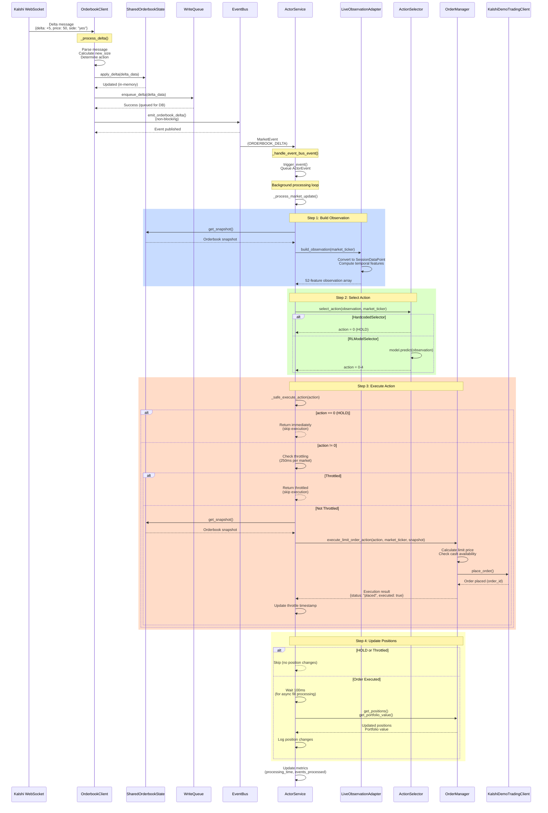

# Orderbook Delta Message Flow

## Sequence Diagram

## Key Points

1. **Non-blocking**: OrderbookClient doesn't wait for ActorService processing
2. **Serial Processing**: Single queue ensures no race conditions
3. **Throttling**: Enforced per-market (250ms minimum between actions)
4. **HOLD Optimization**: HOLD actions skip orderbook fetch, OrderManager call, and position updates
5. **Eventual Consistency**: Position updates wait 100ms for async fill processing

