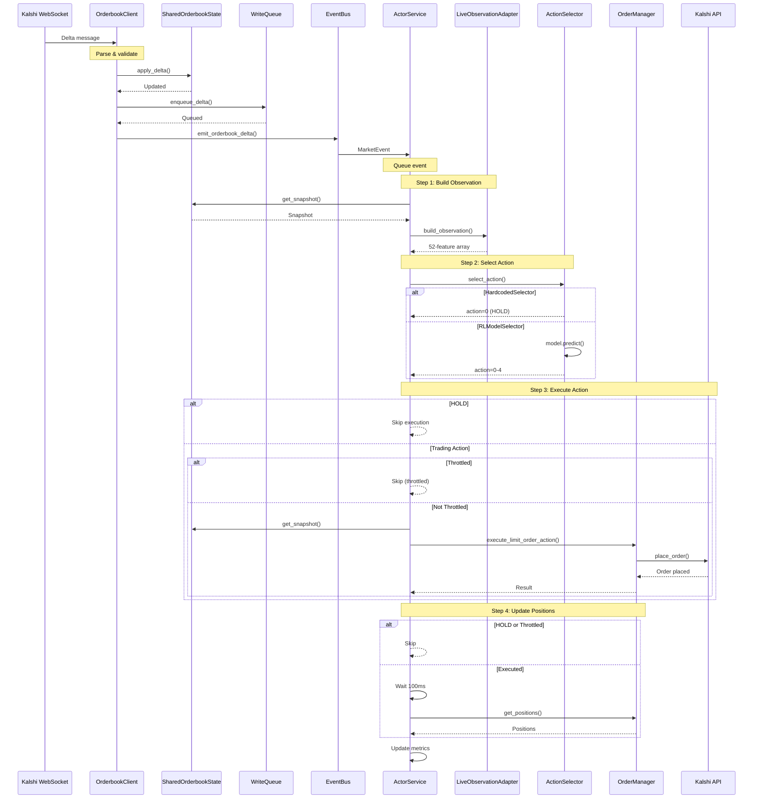

# Orderbook Delta Message Flow

## Sequence Diagram



## Simple Text Flow

```
1. Kalshi WebSocket → OrderbookClient
   └─> Receives delta message {delta: +5, price: 50, side: "yes"}

2. OrderbookClient._process_delta()
   ├─> Parse message, calculate new_size
   ├─> SharedOrderbookState.apply_delta() → Update in-memory orderbook
   ├─> WriteQueue.enqueue_delta() → Queue for DB write (non-blocking)
   └─> EventBus.emit_orderbook_delta() → Publish event (non-blocking)

3. EventBus → ActorService
   └─> ActorService._handle_event_bus_event() receives MarketEvent
       └─> trigger_event() → Queue ActorEvent (non-blocking)

4. ActorService Background Loop
   └─> _process_market_update() processes queued event

5. Step 1: Build Observation
   ├─> ActorService → SharedOrderbookState.get_snapshot()
   ├─> ActorService → LiveObservationAdapter.build_observation()
   │   ├─> Convert to SessionDataPoint format
   │   └─> Compute temporal features (activity_score, momentum, time_gap)
   └─> Returns: 52-feature numpy array

6. Step 2: Select Action
   ├─> ActorService → ActionSelector.select_action(observation, market_ticker)
   │
   ├─> If HardcodedSelector:
   │   └─> Returns: action = 0 (HOLD)
   │
   └─> If RLModelSelector:
       ├─> Uses cached PPO model (loaded once at startup)
       ├─> model.predict(observation, deterministic=True)
       └─> Returns: action = 0-4 (HOLD or trading action)

7. Step 3: Execute Action
   ├─> ActorService._safe_execute_action(action, market_ticker)
   │
   ├─> If action == 0 (HOLD):
   │   └─> Return immediately (skip orderbook fetch, OrderManager call)
   │
   └─> If action != 0 (Trading action):
       ├─> Check throttling (250ms since last action for this market)
       │
       ├─> If throttled:
       │   └─> Return {"status": "throttled"} (skip execution)
       │
       └─> If not throttled:
           ├─> Fetch orderbook snapshot
           ├─> OrderManager.execute_limit_order_action(action, market_ticker, snapshot)
           │   ├─> Calculate limit price from snapshot
           │   ├─> Check cash availability (for BUY orders)
           │   └─> KalshiDemoTradingClient.place_order() → Kalshi API
           │       └─> Returns: order_id
           └─> Update throttle timestamp

8. Step 4: Update Positions
   ├─> If HOLD or throttled:
   │   └─> Skip (no position changes)
   │
   └─> If order executed:
       ├─> Wait 100ms (for async fill processing)
       ├─> OrderManager.get_positions() → Read updated positions
       ├─> OrderManager.get_portfolio_value() → Read portfolio value
       └─> Log position changes

9. Update Metrics
   └─> Track processing_time, events_processed, errors, etc.
```

## Key Points

1. **Non-blocking**: OrderbookClient doesn't wait for ActorService processing
2. **Serial Processing**: Single queue ensures no race conditions
3. **Throttling**: Enforced per-market (250ms minimum between actions)
4. **HOLD Optimization**: HOLD actions skip orderbook fetch, OrderManager call, and position updates
5. **Eventual Consistency**: Position updates wait 100ms for async fill processing

