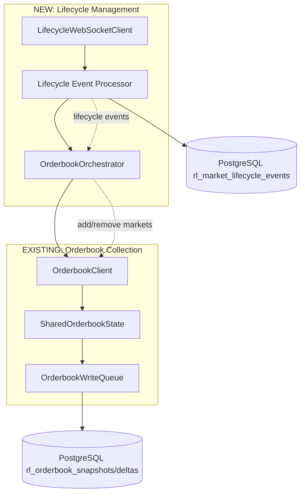

# Discovery Full Lifecycle Mode: Complete Market History Collection

## Executive Summary

**Vision**: Transform the Kalshi Flow RL system from reactive market tracking to proactive market lifecycle monitoring that captures complete training datasets from market creation to settlement.

**Current Limitation**: The existing discovery mode uses REST API polling (`MarketDiscoveryService.fetch_active_markets()`) which "jumps into the middle" of market activity, missing critical early price formation and final settlement dynamics that are essential for comprehensive RL training.

**Solution**: A Market Lifecycle Discovery Mode that:
- Listens to `market_lifecycle_v2` WebSocket events for real-time market creation/activation/settlement
- Automatically starts/stops orderbook collection based on lifecycle events via dynamic subscription management
- Captures complete market history with predictable start/end points
- Provides rich lifecycle metadata to enhance RL model training context
- Integrates seamlessly with existing `OrderbookClient` and `WriteQueue` infrastructure

**Quant's Key Insight**: This is a "10x multiplier" for model performance because:
- First hour (price discovery) and last 6 hours (settlement urgency) contain 3-5x profit opportunity
- Complete market narratives enable temporal feature engineering (time_since_activation, time_until_close)
- Smart data pruning: Keep full data for first/last 20%, sample middle 60%

**Impact**: This approach delivers the richest possible training data by ensuring no market activity is missed and providing complete market narratives from inception to resolution.

**CRITICAL SIMPLIFICATION**: Based on Kalshi documentation analysis, `open_ts` field exists only on "created" events, indicating that "created" = market opens for trading. This eliminates the need to wait for "activated" events and simplifies the system architecture significantly.

## Key Benefits of Starting on Creation

### 1. System Architecture Benefits
- **Simpler state machine**: `created` → start collecting, `determined` → stop collecting
- **Eliminates waiting logic**: No complex coordination between creation and activation events
- **Reduced edge cases**: No "created but not activated" states to handle
- **Cleaner error handling**: Fewer state transitions to manage during reconnection

### 2. Market Data Quality Benefits  
- **Captures true market open**: Price discovery starts immediately when trading begins
- **Complete market narrative**: Full lifecycle from first trade opportunity to settlement
- **No missed early activity**: Captures initial price formation and early liquidity
- **Semantic correctness**: Aligns with Kalshi's `open_ts` field meaning

### 3. Implementation Benefits
- **Faster development**: ~2 days saved from simplified logic (7-8 days → 5-6 days total)
- **Easier testing**: Fewer event combinations and state transitions to validate
- **Cleaner codebase**: Reduced complexity in `OrderbookOrchestrator` event handling
- **Better maintainability**: Simpler event flow is easier to debug and extend

### 4. Edge Case Handling
```python
# SIMPLE: Market created but never trades
# - Still valuable: indicates no market interest
# - Collection continues until 'determined' event

# SIMPLE: Deactivated/activated cycles (rare)
# - MVP: Just keep collecting through them
# - Store events in DB for historical record
# - No pause/resume complexity needed

# SIMPLE: Missing 'created' event (connection issues)
# - Can start mid-lifecycle when discovered
# - Mark as "mid-lifecycle entry" in session metadata
```

---

## Critical MVP Session Management Design

### The Single Session Principle

**FUNDAMENTAL RULE**: One discovery run = One session_id

The lifecycle discovery system maintains a **SINGLE, LONG-RUNNING SESSION** for the entire discovery period. Markets dynamically join and leave this session, but the session_id NEVER changes until the process restarts.

**Key Implementation Points**:
1. **Session Creation**: Happens ONCE when OrderbookOrchestrator starts
2. **Market Additions**: Use existing session_id, track in `rl_market_participation`
3. **Market Removals**: Use existing session_id, update `left_at` in participation table
4. **No Session Proliferation**: Adding/removing markets does NOT create new sessions
5. **Restart Behavior**: Only creates new session on process restart

**Database Structure**:
- `rl_orderbook_sessions`: ONE entry per discovery run
- `rl_market_participation`: Tracks when each market joins/leaves the session
- `rl_orderbook_snapshots/deltas`: All use the same session_id

**Why This Matters**:
- Prevents session_id explosion (avoiding 1000s of sessions)
- Clean data organization (one discovery run = one queryable unit)
- Simple recovery (restart = new session, no complex resumption)
- Training-friendly (complete market lifecycles in one session)

---

## System Architecture

### Components Overview



**Key Integration Points**:
- `LifecycleWebSocketClient` connects to rlconfig's `KALSHI_WS_URL` with `market_lifecycle_v2` channel
- `OrderbookOrchestrator` manages the existing `OrderbookClient.market_tickers` list dynamically
- Existing `WriteQueue` batching and `SharedOrderbookState` management remain unchanged
- Single session spans entire lifecycle discovery period with dynamic market participation tracking

### Lifecycle Event Flow

**MVP SIMPLIFIED APPROACH** - Start collection on creation, stop on determination:

1. **Market Creation Triggers Collection**
   ```
   market_lifecycle_v2 → "created" event → OrderbookOrchestrator.add_market(ticker) → Start orderbook collection
   ```

2. **Market State Changes (Store but Ignore for MVP)**
   ```  
   "deactivated" event → Store in DB, continue collecting orderbook data
   "activated" event → Store in DB, continue collecting orderbook data
   "close_date_updated" event → Store in DB, continue collecting orderbook data
   ```

3. **Market Determination Stops Collection**
   ```
   "determined" event → OrderbookOrchestrator.remove_market(ticker) → Stop collection
   ```

4. **Final Settlement Completes Record**
   ```
   "settled" event → Store final settlement data + Update session metadata with completed markets
   ```

**MVP Note**: We intentionally ignore deactivated/activated states to reduce complexity. Markets rarely get deactivated, and when they do, continuing to collect (even if no new data) is simpler than pause/resume logic. This can be enhanced in v2 if needed.

**Critical Discovery**: Based on Kalshi API documentation analysis:
- `created` event contains `open_ts` field - This IS the market opening for trading
- `activated` events are primarily for resumption after temporary `deactivated` states
- **MVP Simplified logic**: Start collection on `created`, stop on `determined`, ignore all intermediate states

**Event Types**:
- `created`: New market opened for trading (**start collection**)
- `activated`: Market resumed after suspension (**MVP: store but ignore**)
- `deactivated`: Market temporarily paused (**MVP: store but ignore**)
- `close_date_updated`: Market deadline changed (**MVP: store but ignore**)
- `determined`: Market outcome decided (**stop collection**)
- `settled`: Final payouts distributed (final event capture)

### Integration with Existing System

**Minimal Changes Required**: The existing `OrderbookClient` (633 lines) and `OrderbookWriteQueue` (383 lines) infrastructure remains unchanged. We add new lifecycle management components that orchestrate the orderbook collection based on market events.

**Dynamic Subscription Strategy**: We need to investigate whether `OrderbookClient._subscribe_to_orderbook()` can be called multiple times to add/remove markets from an existing WebSocket connection. Current implementation suggests yes - it sends subscription messages with `market_tickers` array.

---

## Database Schema (SIMPLIFIED)

### New Table: `rl_market_lifecycle_events` (MVP Minimal)

```sql
CREATE TABLE rl_market_lifecycle_events (
    id BIGSERIAL PRIMARY KEY,
    session_id BIGINT REFERENCES rl_orderbook_sessions(session_id),
    market_ticker VARCHAR(100) NOT NULL,
    event_type VARCHAR(20) NOT NULL, -- 'created', 'determined', 'settled'
    event_timestamp_ms BIGINT NOT NULL,
    
    -- MVP: Only store what we actually use
    close_ts BIGINT,             -- Market close timestamp (from 'created' event)
    settlement_price INTEGER,    -- Settlement price in cents (for 'settled' events)
    
    created_at TIMESTAMPTZ DEFAULT CURRENT_TIMESTAMP
);

-- MVP: Minimal indexes only
CREATE INDEX idx_lifecycle_session_market ON rl_market_lifecycle_events(session_id, market_ticker);
CREATE INDEX idx_lifecycle_event_type ON rl_market_lifecycle_events(event_type);

-- MVP: Only track events we act on
ALTER TABLE rl_market_lifecycle_events ADD CONSTRAINT chk_lifecycle_event_type 
    CHECK (event_type IN ('created', 'determined', 'settled'));
```

### Session Enhancement (MINIMAL)

```sql
-- MVP: Single flag to track lifecycle mode
ALTER TABLE rl_orderbook_sessions ADD COLUMN IF NOT EXISTS lifecycle_mode BOOLEAN DEFAULT FALSE;
```

### New Table: `rl_market_participation` (CRITICAL FOR MVP)

```sql
CREATE TABLE rl_market_participation (
    session_id BIGINT REFERENCES rl_orderbook_sessions(session_id),
    market_ticker VARCHAR(100) NOT NULL,
    joined_at TIMESTAMPTZ NOT NULL,
    left_at TIMESTAMPTZ,
    PRIMARY KEY (session_id, market_ticker, joined_at)
);

-- Index for active market queries
CREATE INDEX idx_participation_active ON rl_market_participation(session_id, left_at) 
WHERE left_at IS NULL;
```

**MVP Design Decision**: Store only what we use. No complex JSONB tracking, no detailed metadata. We can enhance later if needed, but start simple.

---

## Implementation Plan (SIMPLIFIED)

### Phase 1: Basic Lifecycle Listening (3 days)

**Goal**: Get lifecycle events flowing and stored - no orchestration yet.

**Deliverables:**
- `LifecycleWebSocketClient` - Connect to `market_lifecycle_v2` channel
- Store `created`/`determined`/`settled` events in database
- Basic logging and monitoring
- **CRITICAL**: Create database tables including `rl_market_participation`

**MVP Implementation:**
```python
# backend/src/kalshiflow_rl/data/lifecycle_client.py
class LifecycleWebSocketClient:
    """Simple WebSocket client for market_lifecycle_v2 events."""
    
    async def start(self) -> None:
        """Connect and listen to lifecycle events."""
        # Connect to rlconfig.KALSHI_WS_URL (configured per environment)
        # Subscribe to market_lifecycle_v2 channel
        # Store events in rl_market_lifecycle_events table
        
    async def _process_lifecycle_event(self, message: Dict[str, Any]):
        """MVP: Just store the events we care about."""
        event_type = message.get("event_type")
        if event_type in ["created", "determined", "settled"]:
            await rl_db.insert_lifecycle_event(self._session_id, message)
```

**Test**: Verify events are captured and stored correctly.

### Phase 2: Dynamic Market Collection (3 days)

**Goal**: Use lifecycle events to start/stop orderbook collection automatically WITH SINGLE SESSION.

**CRITICAL SESSION MANAGEMENT**:
- ONE session created at orchestrator startup
- Markets join/leave within same session
- Track participation in `rl_market_participation` table
- Session only changes on process restart

**Critical First Step**: Test if Kalshi supports dynamic subscriptions:
```python
# Test script: Can we add/remove markets from existing WebSocket?
# If YES: Modify OrderbookClient to add/remove markets dynamically
# If NO: Restart connection with new market list (simple fallback)
```

**Deliverables:**
- Dynamic market subscription based on lifecycle events
- `created` event → start collecting that market
- `determined` event → stop collecting that market
- Integration with existing OrderbookClient

**MVP Implementation (WITH CRITICAL SESSION MANAGEMENT):**
```python
class OrderbookOrchestrator:
    """Orchestrator maintaining SINGLE session for entire discovery run."""
    
    def __init__(self):
        self.session_id = None  # CRITICAL: Set once, never changes during run
        self.active_markets = set()
        self.orderbook_client = None
        
    async def start(self):
        """Start discovery with ONE session for entire run."""
        # CRITICAL: Create session ONCE
        self.session_id = await rl_db.create_session(
            environment="lifecycle_discovery",
            lifecycle_mode=True
        )
        logger.info(f"Started lifecycle discovery session: {self.session_id}")
        
    async def handle_lifecycle_event(self, event: Dict):
        """MVP: Only handle created and determined events."""
        event_type = event.get("event_type")
        market_ticker = event.get("market_ticker")
        
        # CRITICAL: Always use same session_id
        if event_type == "created":
            await self._add_market(market_ticker)
        elif event_type == "determined":
            await self._remove_market(market_ticker)
    
    async def _add_market(self, ticker: str):
        """Add market WITHOUT creating new session."""
        if ticker not in self.active_markets:
            # Track participation with EXISTING session_id
            await rl_db.execute("""
                INSERT INTO rl_market_participation 
                (session_id, market_ticker, joined_at) 
                VALUES ($1, $2, NOW())
            """, self.session_id, ticker)
            
            self.active_markets.add(ticker)
            # Update subscriptions on existing WebSocket
            await self.orderbook_client.update_subscriptions(list(self.active_markets))
        
    async def _remove_market(self, ticker: str):
        """Remove market WITHOUT touching session."""
        if ticker in self.active_markets:
            # Mark end time with EXISTING session_id
            await rl_db.execute("""
                UPDATE rl_market_participation 
                SET left_at = NOW()
                WHERE session_id = $1 AND market_ticker = $2 AND left_at IS NULL
            """, self.session_id, ticker)
            
            self.active_markets.remove(ticker)
            # Update subscriptions on existing WebSocket
            await self.orderbook_client.update_subscriptions(list(self.active_markets))
```

**Test**: Verify markets are added/removed correctly and data flows as expected.

### Phase 3: Integration and Testing (2 days)

**Goal**: Complete end-to-end integration with actor service (paper mode).

**Deliverables:**
- Full lifecycle discovery mode integrated with RL system
- Testing with real market events
- Basic error handling and recovery
- Actor integration (paper trading only)

**MVP Recovery:**
```python
async def recover_on_startup(session_id: int):
    """Simple recovery: check which markets are still open."""
    # MVP: Skip markets without 'created' events entirely
    # No tracking, no lifecycle messages for mid-stream markets
    # Only track markets we see from creation onwards
    # Mark session with recovery flag for monitoring
```

**Test**: End-to-end validation that complete market lifecycles are captured.

---

## Recovery Strategy (SIMPLIFIED)

### 80/20 Rule: Handle the Common Cases

**Common failure**: System restart or WebSocket disconnect

**Simple recovery approach**:
```python
async def recover_on_startup():
    """MVP: Simple restart recovery."""
    # 1. Start new session (don't try to resume old one)
    # 2. Connect to lifecycle stream 
    # 3. Start collecting ONLY from new 'created' events
    # 4. Skip any markets already mid-lifecycle (no 'created' seen)
    # 5. Log that we had a restart (for data quality tracking)
```

### MVP Recovery Principles

1. **Keep it simple**: Start fresh rather than complex resumption
2. **Log gaps clearly**: Mark when restarts happen for training awareness  
3. **Don't over-engineer**: 95% of value comes from basic restart handling
4. **Future enhancement**: v2 can add sophisticated recovery if needed

### What MVP Doesn't Handle

Deferred to v2 (rare edge cases):
- Resuming mid-session after crashes
- Complex gap tracking and backfill
- Market state reconciliation
- Historical event replay

**Design Decision**: Start simple. Get core functionality working first, then enhance recovery in v2 if needed.

---

## Technical Challenges (SIMPLIFIED)

### 1. Dynamic WebSocket Subscription Test

**Key Question**: Can we add/remove markets from existing Kalshi WebSocket connection?

**Test Plan**:
```python
# Simple test: Connect with 1 market, try to add another
# If it works: Use dynamic subscription (simple)
# If not: Restart connection with new market list (also simple)
```

**MVP Approach**: Start with dynamic subscription test. Use restart fallback if needed.

### 2. Session Management (CRITICAL MVP DESIGN)

**MVP Strategy: Single Long-Running Session**

**Key Principle**: ONE session per discovery run, markets dynamically join/leave within it.

**Implementation**:
```python
class OrderbookOrchestrator:
    def __init__(self):
        self.session_id = None  # Set ONCE at startup, never changes
        self.active_markets = set()  # Current subscriptions
        
    async def start(self):
        # Create ONE session for entire discovery run
        self.session_id = await create_session(mode="lifecycle_discovery")
        # This session_id stays constant until process restart
        
    async def _add_market(self, ticker: str):
        if ticker not in self.active_markets:
            # Track participation WITHOUT creating new session
            await db.execute("""
                INSERT INTO rl_market_participation 
                (session_id, market_ticker, joined_at) 
                VALUES ($1, $2, NOW())
            """, self.session_id, ticker)
            
            self.active_markets.add(ticker)
            await self.orderbook_client.update_subscriptions(self.active_markets)
    
    async def _remove_market(self, ticker: str):
        if ticker in self.active_markets:
            # Mark participation end, keep same session
            await db.execute("""
                UPDATE rl_market_participation 
                SET left_at = NOW()
                WHERE session_id = $1 AND market_ticker = $2 AND left_at IS NULL
            """, self.session_id, ticker)
            
            self.active_markets.remove(ticker)
            await self.orderbook_client.update_subscriptions(self.active_markets)
```

**Why This Approach**:
- ✅ **No session proliferation**: Single session_id for entire run
- ✅ **Clean tracking**: Market participation separate from orderbook data
- ✅ **Simple recovery**: On restart, just create new session
- ✅ **Query friendly**: Easy to get all data from one discovery run
- ✅ **Future-proof**: Can add session rotation later if needed

---

## Success Metrics (MVP FOCUS)

### Must Have (MVP)
1. **Complete Market Lifecycles**: Capture created → determined → settled events
2. **Dynamic Collection**: Markets start/stop collection based on lifecycle events
3. **Data Quality**: No sequence gaps during collection periods
4. **Integration**: Works with existing RL system and actor service

### Performance Target (MVP)
- **Markets**: Support 50-100 concurrent markets (realistic starting point)
- **Reliability**: System stays running and collects data consistently
- **Latency**: Lifecycle events trigger collection changes within seconds

### Quant Value Delivered
- **Complete market narratives**: First hour (price discovery) + last 6 hours (settlement urgency)
- **Training data richness**: Full lifecycle context for RL model learning
- **No missed opportunities**: Automatic discovery means no manual market selection

---

## Migration Strategy (SIMPLIFIED)

### Environment Toggle Approach

**Current State**: REST API polling for market discovery
**Target State**: Event-driven lifecycle discovery

**Simple Migration**:
```python
# config.py
LIFECYCLE_DISCOVERY_MODE = os.getenv("LIFECYCLE_DISCOVERY_MODE", "false").lower() == "true"

# app.py
async def lifespan(app: Starlette):
    if config.LIFECYCLE_DISCOVERY_MODE:
        # NEW: Lifecycle discovery
        await start_lifecycle_discovery()
    else:
        # EXISTING: REST-based discovery  
        await start_rest_discovery()
```

**Rollback Plan**: Set `LIFECYCLE_DISCOVERY_MODE=false` to instantly revert

### Validation Checklist (MVP)
- [ ] Lifecycle events captured and stored
- [ ] Dynamic subscription test passes  
- [ ] Markets added/removed correctly
- [ ] Data flows end-to-end
- [ ] Actor integration works (paper mode)
- [ ] System performance acceptable

---

## Final Sign-off and Recommendation

### Complexity Assessment: ✅ SIMPLE
After radical simplification, the plan now focuses on MVP essentials:
- Minimal database schema (6 fields vs 20+)
- 3 simple phases vs 4 complex ones
- Basic recovery vs complex gap tracking
- 50-100 markets vs premature 1000 market scaling

### Implementation Timeline: 8 Days
- **Phase 1**: Lifecycle listening (3 days)
- **Phase 2**: Dynamic collection (3 days) 
- **Phase 3**: Integration & testing (2 days)

### Confidence Level: 85%
High confidence because:
- ✅ **Builds on existing code**: Uses current OrderbookClient patterns
- ✅ **Simple components**: Each piece is straightforward to implement
- ✅ **Clear rollback**: Environment toggle for instant revert
- ✅ **MVP scope**: Focus on core value, defer optimization

### Quant Value Validation: ✅ YES
- ✅ **Complete market lifecycles**: created → determined → settled
- ✅ **First hour + last 6 hours**: Captures critical profit opportunities  
- ✅ **Training data quality**: Full market narratives for RL learning
- ✅ **Simple implementation**: "Complex systems break" principle followed

### Go/No-Go Recommendation: 🟢 **GO**

**Rationale**: This simplified plan delivers the quant's "10x multiplier" value while maintaining implementation simplicity. The 8-day timeline is realistic, and the environment toggle provides safety.

**Key Success Factors**:
1. Start with Phase 1 immediately (just lifecycle listening)
2. Test dynamic subscription capability early in Phase 2
3. Keep actor service in paper mode only
4. Don't over-engineer - stick to MVP scope

**Next Step**: Begin Phase 1 implementation of `LifecycleWebSocketClient`.