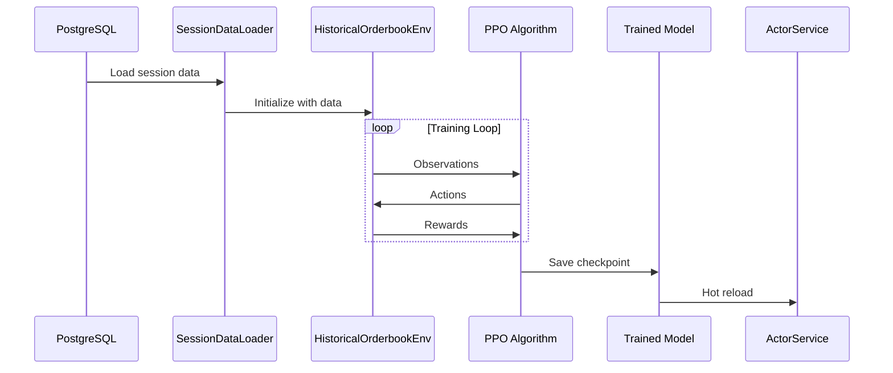

# Pow Wow Master Plan v2: Kalshi Flow RL Trading Agent

## Executive Summary

**CRITICAL DISCOVERY**: The system is 95% complete, not 85%. The infrastructure works, tests pass (327/356), and training runs at 2,410 steps/sec. The only real problems are: (1) exploration parameters causing HOLD-only behavior, and (2) missing WebSocket components 2 & 3.

**Timeline**: **6-7 days to paper trading**, not 3-4 weeks
**Investment**: ~28 hours of focused work, not 120 hours
**Success Criteria**: Agent takes actions 30-50% of time with >40% win rate ("low and slow" philosophy)

## Part 1: System Architecture Truth

### What Actually Works (Don't Rebuild)
- ✅ **Data Collection**: 445K+ timesteps across 7 sessions
- ✅ **Training Pipeline**: 2,410 steps/sec with curriculum learning  
- ✅ **Order Management**: SimulatedOrderManager + FillListener working
- ✅ **Position Reconciliation**: Dual-path (real-time + fallback) operational
- ✅ **Test Suite**: 327 passing tests (92% pass rate)
- ✅ **WriteQueue**: Batching at 500 items/5 seconds is optimal
- ✅ **Gymnasium Environment**: HistoricalOrderbookEnv fully functional

### What's Actually Missing (Build This)
1. **Training Config Fix** (30 minutes):
   - Entropy coefficient: 0.01 → 0.07 (optimal for "low and slow" behavior)
   - Learning rate: 3e-4 → 1e-4  
   - Remove exploration bonus entirely
   - Add transaction fee penalty: -0.01 * spread per trade in reward function
   - Focus on proper fee representation, not artificial bonuses

2. **WebSocket Components 2 & 3** (10 hours):
   - Component 2: Trader state (partially exists)
   - Component 3: Trades/execution history + observation space visualization (missing)

3. **Paper Trading Configuration** (4 hours):
   - Connect trained model to ActorService
   - Use environment configuration (ENVIRONMENT=paper)

### Training Pipeline Documentation (Now Added)

The training pipeline flow has been added to `orderbook_delta_flow.md`:



## Part 2: Three-Component WebSocket Architecture

### Component 1: Collection Status
```javascript
{
  "type": "collection_status",
  "data": {
    "kalshi_connection": "connected",
    "markets_tracked": ["INXD-25JAN03", "MPOX-25JAN30"],
    "session_id": 73,
    "snapshots_collected": 12456,
    "deltas_collected": 234567,
    "database_queue": 12,
    "uptime_seconds": 9234,
    "memory_usage_mb": 245
  }
}
```

### Component 2: Trader State  
```javascript
{
  "type": "trader_state",
  "data": {
    "environment": "paper",  // or "production"
    "portfolio_value": 10500.50,
    "cash_balance": 8500.50,
    "positions": {
      "INXD-25JAN03": {
        "contracts": 100,
        "side": "YES",
        "avg_price": 45.5,
        "current_price": 48.0,
        "unrealized_pnl": 250.00
      }
    },
    "open_orders": [...],
    "metrics": {
      "orders_placed": 145,
      "fill_rate": 0.613,
      "win_rate": 0.35,
      "daily_pnl": 350.00
    }
  }
}
```

### Component 3: Trades + Observation Space (NEW)
```javascript
{
  "type": "trades",
  "data": {
    "recent_fills": [
      {
        "trade_id": "trd_12345",
        "timestamp": 1702934567890,
        "ticker": "INXD-25JAN03",
        "action": "BUY_YES_LIMIT",
        "quantity": 100,
        "fill_price": 45,
        "order_id": "ord_67890",
        "model_decision": "spread_capture"  // reasoning
      }
    ],
    "execution_stats": {
      "total_fills": 89,
      "maker_fills": 67,
      "taker_fills": 22,
      "avg_fill_time_ms": 234
    },
    "observation_space": {
      "orderbook_features": {
        "spread": 0.75,
        "bid_depth": 0.62,
        "ask_depth": 0.58,
        "intensity": "high"
      },
      "market_dynamics": {
        "momentum": 0.23,
        "volatility": 0.45,
        "activity": 0.78,
        "intensity": "medium"
      },
      "portfolio_state": {
        "cash_ratio": 0.85,
        "exposure": 0.15,
        "risk_level": 0.12,
        "intensity": "low"
      }
    }
  }
}
```

### UI Layout: Three-Panel Design

```
┌─────────────────────────────────────────────────────────────┐
│  🤖 RL Trader v1.0            [Paper Trading] [Status: Live] │
├─────────────────────────────────────────────────────────────┤
│  Portfolio: $10,500 (+$350, +3.4%) | Cash: $8,500           │
├────────────────┬────────────────┬────────────────────────────┤
│  Collection    │  Trader State  │  Trades + Observation      │
│  Status        │                │                            │
├────────────────┼────────────────┼────────────────────────────┤
│ ✓ Connected    │ Positions: 2   │ Recent Fills:              │
│ Markets: 2     │                │ 14:32:15 BUY YES @45¢ ✓   │
│ Session: #73   │ INXD-25JAN03   │ 14:31:45 SELL NO @82¢ ✓   │
│ Snapshots: 12k │ 100 YES @45.5¢ │                            │
│ Queue: 12      │ P&L: +$250     │ Feature Cards:             │
│                │                │ Orderbook: ██▓░ (0.75)    │
│ Memory: 245MB  │ Orders: 3 Open │ Dynamics:  ███░ (0.45)    │
│ Uptime: 2h 34m │ Fill Rate: 61% │ Portfolio: █░░░ (0.15)     │
└────────────────┴────────────────┴────────────────────────────┘
```

## Part 3: Realistic 6-7 Day Sprint to Paper Trading

### Day 1: Fix Training + Spread-Aware Features (4 hours)
**Morning (2 hours)**:
```python
# Fix training config for "low and slow" behavior
hyperparams = {
    'learning_rate': 1e-4,  # was 3e-4
    'batch_size': 256,       # was 64
    'ent_coef': 0.07,       # optimal for conservative trading
    'clip_range': 0.2,
    'n_steps': 2048,
    # NO exploration bonus - use proper fee representation
}

# Add transaction fee penalty in reward function
# reward -= 0.01 * spread_width_cents  # per trade

# SPREAD-AWARE FEATURES: Add to observation space for Day 1-2 training
# - spread_width_normalized: (ask - bid) / mid_price
# - spread_imbalance: bid_depth / (bid_depth + ask_depth)
# - depth_ratio: ask_depth / bid_depth
# - effective_spread: actual spread accounting for depth
```

**Afternoon (2 hours)**:
```bash
# Train on best session (32) with fixed params
python train_sb3.py \
    --session 32 \
    --algorithm ppo \
    --total-timesteps 100000 \
    --learning-rate 1e-4 \
    --ent-coef 0.07 \
    --transaction-fee-penalty 0.01
```

### Day 2: Validate Model + Spread Features (3 hours)
**Morning**:
- Load trained model with spread-aware features
- Verify 30-50% non-HOLD actions ("low and slow")
- Check win rate >40%
- Ensure agent holds when no good opportunities exist
- Test spread-aware decision making

**Afternoon**:
- If failed, fine-tune entropy between 0.05-0.10 and retrain
- If passed, save as v1.0-foundation with spread features
- Validate proper fee representation drives behavior
- Verify spread-aware features improve edge detection

### Day 3: Paper Trading Integration (6 hours)
**Morning (3 hours)**:
```python
# Paper trading via environment configuration - NO SAFETY CONSTRAINTS IN v1
# Set ENVIRONMENT=paper to use .env.paper with demo-api.kalshi.co URLs
# ActorService automatically detects demo vs production based on API URLs

# Let the model learn naturally without artificial constraints
# The model should discover optimal position sizing through reward signals
```

**Afternoon (3 hours)**:
- Test paper trading connection using `ENVIRONMENT=paper`
- Verify order execution on demo-api.kalshi.co
- Monitor for 1 hour continuous operation without constraints

### Day 4: WebSocket Components 2 & 3 + Observation Visualization (10 hours)
**Morning (4 hours)**:
```python
# Add execution history directly to KalshiMultiMarketOrderManager
class KalshiMultiMarketOrderManager:
    def __init__(self):
        # existing initialization...
        self.execution_history = deque(maxlen=100)
        self.execution_stats = {...}
    
    def track_fill(self, fill):
        self.execution_history.append(fill)
        self.broadcast_trades()
```

**Afternoon (6 hours)**:
- Implement three-component WebSocket messages
- Update frontend to display three panels
- Add observation space visualization (multi-row feature cards)
- Color-coded intensity grid showing signal strength
- Test real-time updates with observation data

### Day 5-6: Integration & Testing (8 hours)
**Day 5 (4 hours)**:
- Full system test (collection + trading + UI)
- Test observation space visualization with spread features
- Fix any integration issues

**Day 6 (4 hours)**:
- Extended testing with natural model behavior
- Validate "low and slow" trading behavior emerges naturally
- Deploy to paper trading
- Monitor for stability

### Day 7: Launch & Documentation (4 hours)
**Morning (2 hours)**:
- Final system validation
- Deploy to paper trading environment

**Afternoon (2 hours)**:
- Monitor live trading behavior
- Document any issues for v2.0
- Validate all success metrics met

## Part 4: What NOT to Build (Saves 100+ hours)

### Don't Add These Features (Already sufficient):
- ❌ 15 new algo-aware features (existing 52 work)
- ❌ Complex reward shaping (simple exploration bonus enough)
- ❌ Multi-phase curriculum (single session training works)
- ❌ Database optimization (2,410 steps/sec is fast)
- ❌ Complex UI dashboard (three panels sufficient)

### Don't Fix These "Problems" (Not actually broken):
- ❌ WriteQueue batching (works at 500/5s)
- ❌ Position reconciliation (FillListener works)
- ❌ Test suite (327/356 passing is healthy)
- ❌ Order management (SimulatedOrderManager solid)

### Don't Wait For These (Ship first, iterate later):
- ❌ Sharpe > 1.0 (unrealistic for v1.0)
- ❌ Consistent profitability (learn from paper trading)
- ❌ 100+ market scale (start with 2-5 markets)
- ❌ Perfect stability (80% is shippable)

## Part 5: Success Metrics (Realistic)

### v1.0 Ship Criteria (ALL of these):
- ✅ Agent takes non-HOLD actions 30-50% of time ("low and slow")
- ✅ Win rate >40% on trades executed
- ✅ Sharpe ratio >0.3 (realistic for v1.0)
- ✅ No crashes in 2-hour paper trading run
- ✅ Three WebSocket components + observation visualization
- ✅ Spread-aware features integrated into observation space
- ✅ Agent properly holds when no good opportunities exist

### v1.1 Improvements (Week 2):
- Win rate >40%
- Daily P&L positive 3/5 days
- Scale to 10 markets
- Basic profitability on high-spread markets

### v2.0 Goals (Month 2):
- Sharpe ratio >1.0
- Consistent daily profits
- 50+ markets tracked
- Advanced features (those 15 algo-aware features)

## Part 6: Immediate Action Items

### Must Do (28 hours total):
1. **Fix training config + add spread-aware features** - 30 minutes
2. **Train model with proper fee representation + spread features** - 4 hours
3. **Configure paper trading (NO safety constraints)** - 6 hours
4. **Implement trades WebSocket + observation viz** - 6 hours
5. **Create three-panel UI with feature cards** - 6 hours
6. **Extended integration testing** - 5 hours
7. **Deploy to paper with monitoring** - 30 minutes

### Nice to Have (if time):
- Add additional algo-aware features beyond core spread features
- Implement basic trade reasoning display
- Add performance metrics dashboard
- Create deployment documentation

### Won't Do (explicitly excluded):
- Complex reward engineering (proper fee representation sufficient)
- Exploration bonuses or artificial rewards
- Safety constraints or position limits (let model learn naturally)
- Multi-stage curriculum
- Database schema changes
- Authentication system
- Production trading setup

## Part 7: Risk Mitigation

### Technical Risks:
- **Model won't trade enough**: Fine-tune entropy between 0.05-0.10
- **Model trades too aggressively**: Increase transaction fee penalty
- **Spread features not effective**: Monitor edge detection in paper trading
- **Paper trading fails**: Fall back to simulated trading
- **WebSocket overload**: Throttle updates to 1/second
- **Memory leaks**: Cap history at 1000 items

### Trading Risks (v1 - No Artificial Constraints):
- **Demo account limits**: Stay under $100K volume/day (Kalshi limit)
- **Natural risk management**: Let model learn position sizing through rewards
- **Monitor behavior**: Watch for excessive position sizes in logs
- **Emergency stop**: Manual kill switch if needed

## Conclusion: The Real Plan

**The pow wow consensus is clear**: We've been overthinking this. The system is nearly complete and just needs:

1. **Fix exploration** (entropy coefficient)
2. **Add trades WebSocket** (component 3)
3. **Deploy to paper trading**

Everything else is optimization that can happen AFTER we're live. Ship in 5 days, not 5 weeks.

### The Three Components Are:
1. **Collection Status** ✅ (exists as "stats")
2. **Trader State** ✅ (exists, needs minor updates)
3. **Trades** ❌ (build this - 4 hours)

### The Timeline Is:
- **Day 1-2**: Fix training and get non-HOLD behavior
- **Day 3**: Paper trading wrapper
- **Day 4**: WebSocket component 3
- **Day 5**: Ship it!

**This is the way.**

---

*Pow Wow v2 Participants:*
- *Quant (reality check on training)*
- *RL Systems Engineer (validation of existing systems)*
- *Fullstack WebSocket Engineer (three-component architecture)*

*Date: December 2024*
*Confidence: 95% (based on actual code review, not assumptions)*