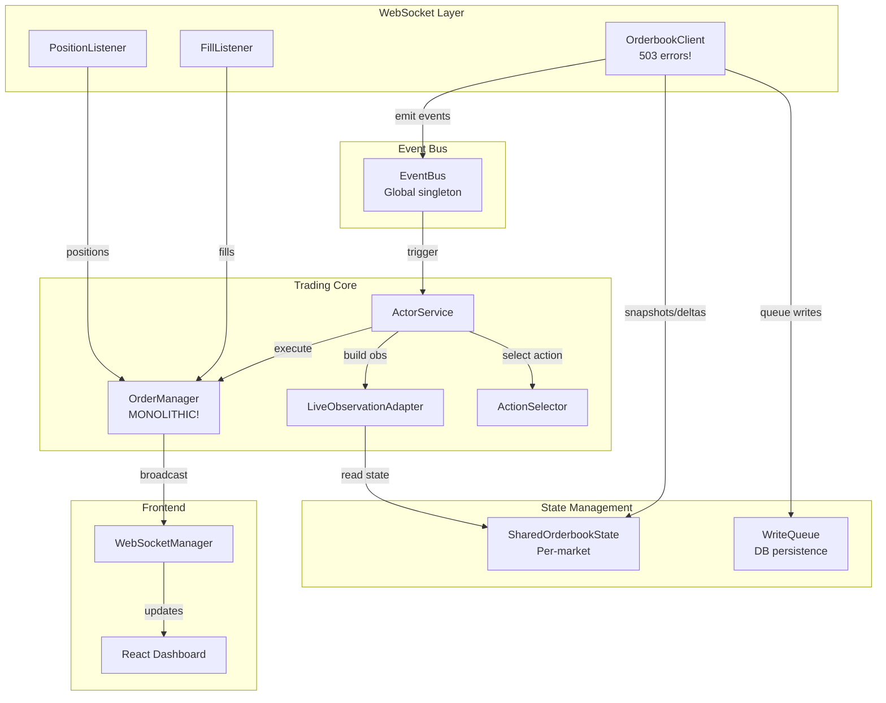

# Current Trader Implementation State & Architecture

## Executive Summary

The Kalshi RL trader has evolved into a complex, monolithic system where the `KalshiMultiMarketOrderManager` has become unmanageable, handling far too many responsibilities. The system suffers from:

1. **503 Service Unavailable errors** with demo-api.kalshi.co orderbook WebSocket (blocking issue for days)
2. **Monolithic OrderManager** with 5000+ lines handling everything from cash tracking to WebSocket management
3. **Tangled state management** with complex calibration flows and drift tracking
4. **Poor separation of concerns** between trading logic, WebSocket connections, and state synchronization

This document maps the current architecture to serve as a blueprint for clean refactoring.

## 1. System Architecture Overview



## 2. Core Components Deep Dive

### 2.1 OrderbookClient (`src/kalshiflow_rl/data/orderbook_client.py`)

**Purpose**: WebSocket client for Kalshi orderbook data

**Current Issues**:
- **503 Service Unavailable errors** when connecting to `wss://demo-api.kalshi.co/trade-api/ws/v2`
- Reconnection logic seems correct but the demo API consistently rejects connections
- Health check logic is complex with grace periods and timeout handling

**Key Responsibilities**:
- WebSocket connection management with RSA authentication
- Subscription to orderbook_delta channel for multiple markets
- Processing snapshots and deltas
- Updating SharedOrderbookState (non-blocking)
- Queuing messages for database persistence
- Emitting events via EventBus for actor triggers

**Error Handling Pattern**:
```python
# Connection loop with exponential backoff
while self._running:
    try:
        await self._connect_and_subscribe()
    except InvalidStatus as e:  # 503 errors come here
        # Exponential backoff up to 60s
        delay = min(config.WEBSOCKET_RECONNECT_DELAY * (2 ** self._reconnect_count), 60)
        await asyncio.sleep(delay)
        self._reconnect_count += 1
```

**Health Check Logic**:
- Grace period of 10 seconds for initial connection
- Requires WebSocket object to exist to be "healthy" during grace
- After grace period, requires snapshots received
- 5-minute timeout for no messages before marking unhealthy

### 2.2 KalshiMultiMarketOrderManager (`src/kalshiflow_rl/trading/kalshi_multi_market_order_manager.py`)

**THE PROBLEM: This class has become a 5000+ line monolith handling:**

1. **Cash Management**
   - Dual tracking: `cash_balance` (synced) vs `_calculated_cash_balance` (real-time)
   - Promise-based cash reservation (Option B pattern)
   - Drift monitoring between calculated and synced values
   - Session tracking with start values

2. **Order Management**
   - Order placement via KalshiDemoTradingClient
   - Order tracking with internal ID mapping
   - Fill processing via dedicated queue
   - Order cancellation and cleanup

3. **Position Management**
   - Position tracking per market
   - P&L calculations (realized and unrealized)
   - Settlement tracking
   - Position closing logic with multiple strategies

4. **WebSocket Listeners**
   - FillListener management (WebSocket for real-time fills)
   - PositionListener management (WebSocket for position updates)
   - Fill queue processing with reconciliation

5. **State Synchronization**
   - Complex calibration flow (3-phase system)
   - Periodic sync with Kalshi API
   - Drift detection and correction
   - State machine for trader status

6. **Trading Control**
   - Trading pause/resume logic
   - Cash reserve threshold enforcement
   - Market closing time checks
   - Position hold time limits

7. **Broadcasting & UI Updates**
   - State change callbacks
   - WebSocket message formatting
   - Multiple message types (orders, positions, portfolio, etc.)

**State Machine Complexity**:
```python
# Trader status states
"starting" -> "calibrating" -> "trading"
           -> "paused" (system issues)
           -> "recovering" (after errors)
```

**Key Data Structures**:
- `OrderInfo`: Tracks order lifecycle with promised cash
- `Position`: Kalshi convention (+contracts for YES, -contracts for NO)
- `FillEvent`: Queue-based fill processing
- `TradeDetail`: Execution history for UI

### 2.3 ActorService (`src/kalshiflow_rl/trading/actor_service.py`)

**Purpose**: Core actor service for multi-market trading decisions

**Architecture**:
- Async queue-based event processing (serial for all markets)
- Model caching with once-at-startup loading
- Non-blocking integration with OrderbookClient via EventBus
- 4-step pipeline: build_observation → select_action → execute_action → update_positions

**Event Flow**:
1. OrderbookClient emits delta event to EventBus
2. ActorService receives event and queues it
3. Processing loop dequeues and processes serially
4. Throttling applied per-market (default 250ms between actions)
5. Circuit breaker can disable markets after errors

**Dependency Injection Support**:
- Can inject EventBus (vs using global singleton)
- Can inject ObservationAdapter
- Supports strict validation mode

### 2.4 LiveObservationAdapter (`src/kalshiflow_rl/trading/live_observation_adapter.py`)

**Purpose**: Convert live SharedOrderbookState to 52-feature observations

**Features**:
- Maintains sliding window history for temporal features
- Converts SharedOrderbookState → SessionDataPoint format
- Uses same feature extraction as training
- Performance optimized for <1ms observation building
- Cache with 100ms TTL for repeated observations

**Integration Points**:
- Reads from SharedOrderbookState (via registry or global)
- Provides observations to ActorService
- Maintains per-market sliding windows

## 3. State Machine & Initialization

### 3.1 InitializationTracker Flow

**Startup Sequence** (from `app.py`):
1. Check exchange status (must be healthy)
2. Start WebSocket manager early
3. Initialize database and write queue
4. Start EventBus
5. Start OrderbookClient
6. Wait for WebSocket connection (30s timeout)
7. Verify orderbook health (data reception)
8. Initialize OrderManager (if actor enabled)
   - Validate credentials
   - Start fill processor
   - Start state machine loop
   - Start FillListener WebSocket
   - Start PositionListener WebSocket
   - Run calibration
   - Sync with Kalshi
9. Initialize ActorService
10. Complete initialization

### 3.2 Component Health Monitoring

Each component reports health status:
- **OrderbookClient**: Connected, receiving data
- **FillListener**: WebSocket connected
- **PositionListener**: WebSocket connected
- **OrderManager**: Calibrated, synced
- **ActorService**: Processing events

### 3.3 Trader Status States

```
starting -> calibrating -> trading -> (various error/recovery states)
```

**Calibration Flow** (3-phase):
1. Balance reconciliation
2. Position validation
3. Order synchronization

## 4. Known Issues & Pain Points

### 4.1 503 Service Unavailable Errors

**Problem**: OrderbookClient consistently gets 503 errors from demo-api.kalshi.co

**Symptoms**:
```
WebSocket connection closed: received 503 (Service Unavailable)
```

**Attempted Solutions**:
- Exponential backoff (working but doesn't solve root cause)
- Connection parameter tuning
- Authentication header validation

**Possible Causes**:
1. Demo API rate limiting or maintenance
2. Incorrect WebSocket URL or path
3. Authentication issues specific to WebSocket
4. Demo account limitations

### 4.2 OrderManager Complexity

**Problems**:
- 5000+ lines in single file
- Handles 15+ different responsibilities
- Complex state tracking with drift monitoring
- Tangled dependencies between subsystems
- Hard to test individual components

**Specific Pain Points**:
- Calibration logic is complex and fragile
- Cash tracking has two parallel systems
- Fill processing queue adds async complexity
- State machine transitions are implicit
- WebSocket listener management is embedded

### 4.3 State Synchronization Problems

**Issues**:
- Drift between calculated and synced values
- Race conditions during initialization
- Complex calibration sequence
- Multiple sources of truth (API vs calculated)

### 4.4 Error Recovery Patterns

**Current Approach**:
- Each WebSocket has its own reconnection logic
- OrderManager has complex recovery flows
- No clear circuit breaker pattern
- Error states are implicit in status tracking

## 5. WebSocket Infrastructure

### 5.1 Three Separate WebSocket Connections

1. **Orderbook WebSocket** (OrderbookClient)
   - URL: `wss://demo-api.kalshi.co/trade-api/ws/v2`
   - Channel: `orderbook_delta`
   - Status: **FAILING WITH 503**

2. **Fills WebSocket** (FillListener)
   - URL: `wss://demo-api.kalshi.co/trade-api/ws/v2`
   - Channel: User fills (authenticated)
   - Status: Usually works

3. **Positions WebSocket** (PositionListener)
   - URL: `wss://demo-api.kalshi.co/trade-api/ws/v2`
   - Channel: User positions (authenticated)
   - Status: Usually works

### 5.2 Message Flow

```
Orderbook WS -> OrderbookClient -> SharedOrderbookState -> EventBus -> ActorService
Fills WS -> FillListener -> FillQueue -> OrderManager -> State Update
Positions WS -> PositionListener -> OrderManager -> State Update
```

### 5.3 Reconnection Strategies

Each WebSocket has independent reconnection:
- Exponential backoff
- Max retry limits
- Health check integration
- Graceful degradation (fallback to REST polling)

## 6. Frontend Integration

### 6.1 WebSocket Manager Broadcasting

**Message Types**:
- `orderbook_snapshot` / `orderbook_delta`
- `trader_state` / `trader_action`
- `orders_update` / `positions_update` / `portfolio_update`
- `fill_event`
- `initialization_*` messages
- `component_health`
- `trader_status`

### 6.2 React Component Data Flow

```
WebSocketManager -> WebSocket Connection -> React Context -> Components
```

**Key Components**:
- SystemHealth: Shows component status
- TraderDashboard: Main trading interface
- OrdersPanel: Active orders
- PositionsPanel: Current positions
- PortfolioMetrics: P&L and performance

## 7. Refactoring Recommendations

### 7.1 Break Up OrderManager Responsibilities

**Proposed Architecture**:
```
OrderManager (slim, coordination only)
├── CashManager (cash tracking, reserves)
├── OrderTracker (order lifecycle)
├── PositionTracker (position management)
├── FillProcessor (fill queue and reconciliation)
├── WebSocketCoordinator (listener management)
├── SyncService (Kalshi API sync)
├── CalibrationService (startup calibration)
└── StateReporter (broadcasting updates)
```

### 7.2 Better Separation of Concerns

1. **Extract State Machine**: Explicit state machine with clear transitions
2. **Separate WebSocket Management**: Dedicated WebSocket coordinator
3. **Isolate Cash Tracking**: Single source of truth for cash
4. **Decouple Broadcasting**: Event-driven broadcasting system
5. **Simplify Calibration**: Streamlined startup sequence

### 7.3 Cleaner Error Handling Patterns

1. **Circuit Breaker Pattern**: Centralized circuit breaker for all services
2. **Error Recovery Manager**: Coordinated recovery strategies
3. **Health Monitor**: Unified health checking system
4. **Graceful Degradation**: Clear fallback paths

### 7.4 Simplified State Management

1. **Single Source of Truth**: One authoritative state per domain
2. **Event Sourcing**: Track all state changes as events
3. **Immutable State**: Functional state updates
4. **State Snapshots**: Periodic state captures for recovery

## 8. Implementation Priority

### Phase 1: Fix 503 Errors (BLOCKING)
1. Investigate demo API status/limitations
2. Test with production API (if available)
3. Implement fallback to REST polling
4. Add better error diagnostics

### Phase 2: Extract Core Services
1. Extract CashManager from OrderManager
2. Extract FillProcessor as separate service
3. Create WebSocketCoordinator
4. Simplify OrderManager to coordination only

### Phase 3: State Machine & Calibration
1. Implement explicit state machine
2. Simplify calibration to single phase
3. Create CalibrationService
4. Add state recovery mechanisms

### Phase 4: Error Handling & Recovery
1. Implement circuit breaker pattern
2. Create ErrorRecoveryManager
3. Unify health monitoring
4. Add graceful degradation paths

## 9. Testing Strategy

### Unit Testing Needs
- Individual service testing (CashManager, FillProcessor, etc.)
- State machine transition testing
- Error recovery scenario testing
- WebSocket reconnection testing

### Integration Testing
- Multi-service coordination
- Event bus message flow
- State synchronization
- Error propagation

### E2E Testing
- Full startup sequence
- Trading flow with fills
- Error recovery scenarios
- Performance under load

## 10. Performance Considerations

### Current Bottlenecks
1. Serial event processing in ActorService
2. Complex calibration sequence on startup
3. Multiple WebSocket connections
4. Synchronous state updates

### Optimization Opportunities
1. Parallel market processing (where safe)
2. Lazy calibration (calibrate on first trade)
3. WebSocket multiplexing
4. Async state updates with eventual consistency

## Conclusion

The current trader implementation works but has become unmaintainable due to the monolithic OrderManager and complex state management. The 503 errors with the orderbook WebSocket are blocking progress and may indicate API issues beyond our control.

The recommended approach is to:
1. First resolve or work around the 503 errors
2. Gradually extract services from OrderManager
3. Implement cleaner patterns for state and errors
4. Improve testing coverage for reliability

This refactoring will make the system more maintainable, testable, and resilient to failures.